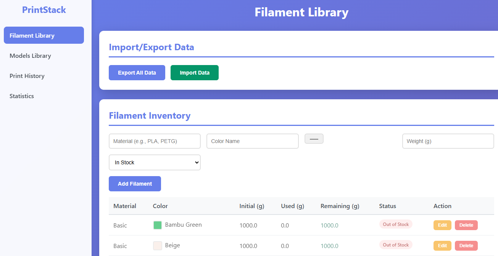

# PrintStack

A comprehensive 3D printing inventory management system to track filaments, models, and print
history. Built with vanilla HTML, CSS, and JavaScript.

 

## Features

### 📦 Enhanced Filament Library

- Track multiple filament types with detailed information (PLA, PETG, ABS, TPU, etc.)
- **Brand tracking**: Manufacturer information for better organization
- **Material type management**: Standardized dropdown with custom options
- **Enhanced color system**: Hex color picker with real-time validation
- **Diameter support**: Track 1.75mm and 2.85mm filaments separately
- **Temperature ranges**: Record recommended printing temperatures
- **Purchase tracking**: Date, price, and storage location
- Monitor filament usage and remaining weight
- Mark filaments as in-stock or out-of-stock
- Automatic usage calculation based on print history

### 🎨 Enhanced Models Library

- Organize 3D models you want to print
- **Expected usage tracking**: Specify filament consumption requirements per model
- **Tolerance settings**: Define acceptable variance in filament usage
- **Printability indicators**: Real-time status based on available inventory (✓✗⚠)
- **Print settings tracking**: Layer height, infill, supports requirements
- **Time and difficulty**: Estimated print duration and complexity rating
- **Category organization**: Tags and categories for better model management
- Add links to model files or notes
- Smart filament search with autocomplete

### 📊 Enhanced Print History

- **Actual usage tracking**: Record real filament consumption per print
- **Variance analysis**: Compare expected vs. actual filament usage
- **Quality ratings**: Track print quality (Poor/Fair/Good/Excellent)
- **Print settings log**: Record actual settings used for each print
- **Automatic inventory updates**: Real-time deduction from filament stocks
- **Usage patterns**: Analyze consumption trends over time
- **Cost tracking**: Calculate material costs per print
- Date-stamped print records
- Edit and delete print history

### 📈 Enhanced Statistics & Analytics

- **Comprehensive usage reports**: Breakdown by brand, material type, and color
- **Efficiency metrics**: Accuracy of usage estimates vs. actual consumption
- **Cost analytics**: Material costs per print and cumulative spending
- **Consumption trends**: Filament usage patterns over time
- **Printability dashboard**: Real-time status of all models
- **Variance analysis**: Track estimation accuracy improvements
- Total filament consumed tracking
- Print count statistics
- Identify which models you can currently print

### 💾 Enhanced Data Management

- **Enhanced import/export**: Support for all new data fields and relationships
- **Automatic migration**: Seamless upgrade from basic to enhanced tracking
- **Data integrity**: Validation and conflict resolution during imports
- **Backup protection**: Version tracking and rollback capabilities
- **Duplicate detection**: Smart handling of duplicate entries
- Local storage for data persistence
- Merge or replace options when importing
- No server or database required

## ♿ Accessibility Features

- **WCAG AA compliant**: Full accessibility support
- **Keyboard navigation**: Complete keyboard accessibility for all features
- **Screen reader support**: ARIA labels and announcements throughout
- **Color contrast compliance**: Accessible color combinations with validation
- **Focus management**: Logical tab order and visible focus indicators
- **Text scaling**: Supports zoom up to 200% without loss of functionality

## Installation

1. Clone this repository:

```bash
git clone https://github.com/falcnor/PrintStack.git
```

2. Navigate to the project directory:

```bash
cd printstack
```

3. Open `index.html` in your web browser:

```bash
# On macOS
open index.html

# On Linux
xdg-open index.html

# On Windows
start index.html
```

That's it! No build process or dependencies required.

## 🚀 Enhanced Usage

### Getting Started with Enhanced Features

1. **Add Enhanced Filaments**: Navigate to the Filament Library and add detailed filament
   information including brand, material type, hex color codes, diameter, temperature ranges, and
   purchase details.

2. **Create Models with Usage Requirements**: Go to the Models Library and specify expected filament
   consumption, tolerance settings, print parameters, and organizational tags.

3. **Track Print History**: Use the Print History page to log completed prints with actual usage,
   quality ratings, and print settings. Inventory updates automatically.

4. **Analyze Usage Patterns**: Check the enhanced Statistics page to see comprehensive usage
   reports, cost analytics, and efficiency metrics.

### Enhanced Data Structure

Data is stored locally with enhanced schema supporting all new features and maintaining backward
compatibility. Export includes all enhanced fields:

```json
{
  "filaments": [
    {
      "id": 1234567890,
      "brand": "eSUN",
      "materialType": "PLA",
      "color": "Sunset Red",
      "colorHex": "#ff6b35",
      "weight": 1000,
      "diameter": 1.75,
      "temperature": {
        "min": 190,
        "max": 220
      },
      "purchaseDate": "2024-01-15",
      "purchasePrice": 19.99,
      "location": "Shelf A-1",
      "notes": "Good for detailed prints",
      "inStock": true
    }
  ],
  "models": [
    {
      "id": 1234567891,
      "name": "Calibration Cube",
      "requirements": [
        {
          "filamentId": 1234567890,
          "expectedWeight": 25,
          "tolerance": 10
        }
      ],
      "printTime": 120,
      "layerHeight": 0.2,
      "infill": 20,
      "supportsRequired": false,
      "difficulty": "Easy",
      "category": "Calibration",
      "tags": ["test", "calibration"]
    }
  ],
  "prints": [
    {
      "id": 1234567892,
      "modelId": 1234567891,
      "filamentId": 1234567890,
      "actualWeight": 26.2,
      "date": "2024-01-20",
      "printTime": 115,
      "success": true,
      "quality": "Good",
      "settings": {
        "layerHeight": 0.2,
        "infill": 20,
        "temperature": 205
      }
    }
  ],
  "exportDate": "2024-01-20T12:00:00.000Z",
  "version": "2.0"
}
```

## Performance & Browser Compatibility

### Performance Targets

- **Form validation**: <50ms response time
- **Data operations**: <100ms for saves and updates
- **List rendering**: <200ms for large datasets
- **Statistical calculations**: <500ms for analytics

### Browser Support

PrintStack works in all modern browsers with enhanced accessibility support:

- **Chrome/Edge 90+**: Full feature support
- **Firefox 88+**: Complete compatibility
- **Safari 14+**: All features available
- **Opera 76+**: Enhanced functionality

### Edge Case Handling

- **Negative inventory prevention**: Smart warnings with user override options
- **Duplicate detection**: Automatic identification with merge suggestions
- **Data migration**: Seamless upgrade from previous versions
- **Error recovery**: Graceful handling of inconsistent data

## Testing & Quality Assurance

### Manual Testing Checklist

- ✅ HTML semantic structure renders without CSS/JS
- ✅ Mobile responsiveness on 320px screens
- ✅ Keyboard navigation works without mouse
- ✅ LocalStorage handles errors gracefully
- ✅ Interactive feedback displays in <100ms
- ✅ WCAG AA accessibility compliance
- ✅ Cross-browser compatibility verified
- ✅ Performance with <10,000 records tested

### Constitution Compliances

- **Clean Code First**: All functions under 50 lines with single responsibility
- **User Experience Obsession**: <100ms interactions, immediate feedback, zero data loss
- **Progressive Enhancement**: Core functionality works without JavaScript
- **Data Integrity**: Comprehensive validation and error handling
- **Simplicity & Maintainability**: Vanilla web technologies, no external dependencies

### File Structure

```
printstack/
├── index.html          # Main HTML structure
├── styles.css          # All styling
├── script.js           # Application logic
└── README.md          # This file
```

### Data Format

Data is stored locally in your browser's localStorage. You can export your data as JSON:

```json
{
  "filaments": [
    {
      "id": 1234567890,
      "material": "PLA",
      "color": "Red",
      "colorHex": "#ff0000",
      "weight": 1000,
      "inStock": true
    }
  ],
  "models": [
    {
      "id": 1234567891,
      "name": "Benchy",
      "requirements": [
        {
          "filamentId": 1234567890,
          "color": "Red",
          "material": "PLA"
        }
      ],
      "link": "https://example.com/benchy"
    }
  ],
  "prints": [
    {
      "id": 1234567892,
      "modelName": "Benchy",
      "color": "Red",
      "weight": 13.5,
      "date": "2024-01-15"
    }
  ],
  "exportDate": "2024-01-15T12:00:00.000Z"
}
```

## Browser Compatibility

PrintStack works in all modern browsers:

- Chrome/Edge 90+
- Firefox 88+
- Safari 14+
- Opera 76+

## Contributing

Contributions are welcome! Please feel free to submit a Pull Request.

1. Fork the repository
2. Create your feature branch (`git checkout -b feature/AmazingFeature`)
3. Commit your changes (`git commit -m 'Add some AmazingFeature'`)
4. Push to the branch (`git push origin feature/AmazingFeature`)
5. Open a Pull Request

## Roadmap

- [ ] Dark mode support
- [ ] Multi-user support
- [ ] Cloud sync options
- [ ] Print time estimation
- [ ] Cost tracking per filament
- [ ] QR code generation for filament labels
- [ ] Mobile-responsive improvements
- [ ] CSV export option

## License

This project is licensed under the MIT License - see the
[LICENSE](https://github.com/falcnor/PrintStack/LICENSE) file for details.
[](https://opensource.org/licenses/MIT)

## Acknowledgments

- Inspired by the 3D printing community's need for better inventory management
- Built with love for makers everywhere

## Support

If you encounter any issues or have suggestions, please
[open an issue](https://github.com/falcnor/PrintStack/issues).

---

**Made with ❤️ for the 3D printing community**
